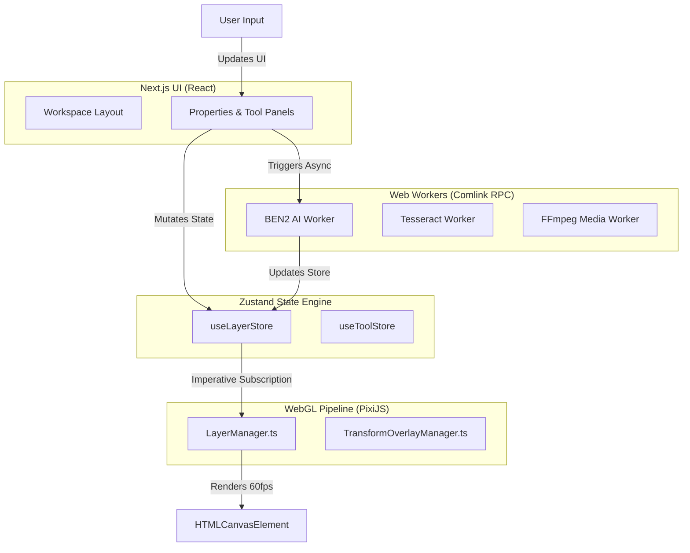

# File Forge Architecture Guide

File Forge is a next-generation, local-first media editor built entirely for the browser. It combines Next.js, PixiJS, and Web Workers to process intense media transformations (Background Removal, OCR, Audio/Video manipulation, PDF editing) directly on the client.

This document provides a deep, comprehensive overview of the system's architecture, data flows, and design patterns.

---

## 1. High-Level System Topology

File Forge uses a strict **decoupled architecture**. The UI layer (React) and the rendering/processing layers (PixiJS, Web Workers) operate on separate lifecycles, bridged entirely by a centralized, event-driven Zustand store.



---

## 2. The WebGL Rendering Pipeline (PixiJS)

The heart of File Forge's image editing experience is the PixiJS v8 engine. To guarantee 60 FPS across all devices, **React is completely removed from the rendering loop during interactions (dragging, scaling, rotating).**

### 2.1 The `LayerManager`

Instead of using declarative libraries like `@pixi/react`, File Forge uses an object-oriented `LayerManager.ts`.

- **Imperative Subscriptions**: The `LayerManager` subscribes directly to `useLayerStore.subscribe()`.
- **Reconciliation**: When the Zustand store updates, `LayerManager` diffs the new state against its internal Map of `PIXI.Container` objects.
- **Transform Syncing**: If a layer's `x`, `y`, `scaleX`, or `rotation` changes in the store, `LayerManager` instantly applies it to the corresponding PIXI Sprite.
- **GPU Masking**: To support AI-driven background removal, `LayerManager` utilizes `PIXI.AlphaMaskPipe`. It caches masks intelligently and ensures old textures are flushed from GPU VRAM (`texture.destroy(true)`) to prevent memory leaks.

### 2.2 The `TransformOverlayManager`

This class manages the UI overlays (bounding boxes, anchor handles, crop grids) that sit on top of the PixiJS stage.

- **Local-to-Global Projection**: It listens to the active layer's matrix and projects a responsive bounding box on the screen.
- **Rule of Thirds**: Dynamically draws high-fidelity grid lines when crop mode is active.

---

## 3. Web Worker Orchestration & AI

AI inference and Video/Audio processing are extraordinarily heavy. If run on the main thread, they would lock the browser UI. File Forge utilizes the **Web Worker Pattern** orchestrated via `Comlink` for seamless RPC (Remote Procedure Call).

### 3.1 Strict Worker Isolation

Previously, File Forge used a single monolithic worker for all AI operations. This caused catastrophic crashes when one library (e.g., ONNX) exhausted memory, taking down unrelated features (e.g., OCR).
The architecture now guarantees **Fault Isolation**:

1. `rmbg.worker.ts`: Exclusively runs `transformers.js` for background removal.
2. `ocr.worker.ts`: Exclusively runs `tesseract.js` for text extraction.
3. `audio.worker.ts` & `video.worker.ts`: Handle `ffmpeg.wasm`.

### 3.2 The AI Pipeline (`AIModelPlugin` Interface)

To future-proof the application against rapid advancements in AI models, models are implemented via the `AIModelPlugin` interface.

- **Hardware Probing**: Before instantiating a model, the orchestrator asynchronously probes `navigator.gpu`.
- **Graceful Fallbacks**: It attempts `WebGPU` (checking for `shader-f16` capabilities), falls back to `WebNN` (NPU), and finally defaults to multi-threaded `WASM` (`navigator.hardwareConcurrency`).
- **Tool-Mount Preloading**: Web Workers are spun up and massive AI models are pre-loaded into VRAM the exact moment a user navigates to a tool page, ensuring instant execution when the user clicks "Apply" rather than waiting for on-demand loading.

---

## 4. State Management (Zustand)

File Forge abandons monolithic global stores in favor of **Modular Slices**.

### 4.1 Store Modules

- `useLayerStore.ts`: The heaviest store. Maintains an array of `Layer` objects, managing Z-indexing, visiblity, and spatial transforms. Also manages the `past` and `future` stacks for Time Travel (Undo/Redo).
- `useToolStore.ts`: Extremely lightweight. Tracks the currently active tool route (e.g., `crop`, `magic-eraser`), brush size, and theme.
- `useAIStore.ts`: Manages AI lifecycle states (loading weights, processing masks, progress percentages).
- `useExportStore.ts`: Bridges the UI with the final canvas snapshot generation.

### 4.2 Zero-Lag React Bindings

Components like `PropertiesPanel` utilize `useShallow` to select _only_ the specific properties they care about (e.g., `s.layers.find(l => l.id === s.activeLayerId)`). This prevents React from reconciling the vast sidebar tree every time the mouse moves 1 pixel.

---

## 5. Routing & SEO Content Architecture

File Forge implements a highly DRY (Don't Repeat Yourself) route structure and a robust MDX-based content system to maximize discoverability without cluttering the UI codebase.

- **Unified Tool Routes**: Dynamic routes (`/image/[tool]`, `/video/[tool]`, etc.) act as generic wrappers. The `ToolPageLayout.tsx` orchestrates the navigation and layout, while the specific tool definition simply dictates which tools to load.
- **DRY Related Tools**: To prevent repetition, a centralized `getRelatedTools` utility (`src/lib/toolUtils.ts`) dynamically resolves cross-linking (e.g., suggesting "Magic Eraser" on the "Remove Background" page) by pulling from the global `TOOL_MENUS` config.
- **next-mdx-remote**: SEO content is loaded from `.mdx` files located in `src/content/tools/`. The content is securely compiled on the server using `next-mdx-remote` and passed as a `seoContent` React Node to the client layout, enabling interactive rich-text documentation directly inside tool workspaces.

---

## 6. The Dynamic Tool Registry

Writing redundant React components (sliders, toggles) for every new filter (Sepia, Vintage, Blur) is inefficient. File Forge utilizes a `toolRegistry.ts`.

- **JSON Definition**: You define a tool, its expected parameters (Min, Max, Default), and its target Web Worker logic in JSON.
- **Dynamic Mounting**: The `DynamicPropertiesPanel` iterates over the registry definition and automatically generates a premium, themed UI.
- **Global Tool State**: Live slider/toggle values are persisted globally in `useToolStore.toolParams`, allowing Canvas overlays and Background Workers to sync natively.
- **Automatic Routing**: `useDynamicTool` intercepts the global state and passes the parameters directly to the designated worker thread.

---

## 7. Persistence & Memory Safety

### 7.1 Dexie.js (IndexedDB)

Holding massive `File` objects or ArrayBuffers in Redux/Zustand RAM will quickly crash the browser (often hitting the 2GB/4GB V8 heap limit).

- **Blob Normalization**: `File` objects are instantly converted to generic `Blob`s and dumped into IndexedDB via `dexie`.
- **Reference Pointers**: The Zustand `useLayerStore` only keeps a lightweight UUID (`fileId`), never the actual Blob.

### 7.2 MongoDB & Supabase (Backend)

- **Identity Layer**: Powered by `@supabase/supabase-js` for seamless Auth.
- **Database Layer**: MongoDB (Mongoose) is used for storing rich user profiles, active subscriptions, and user workspaces.
- **Hot-Reload Caching**: A global Mongoose connection cache (`src/lib/mongodb.ts`) ensures that Next.js Server Actions don't exhaust connection pools during local development.

---

## 8. Smart Export Engine

Exporting is decoupled from specific formats using the **Strategy Pattern**.

- **Unified Interface**: All formats (PNG, WebP, PDF) implement `IExportEngine`.
- **Dumb Modal Shell**: The `<ExportModal>` is a lightweight generic wrapper. It defers entirely to the active engine to provide the UI (`getUI`) and the execution logic.
- **Dynamic Routing**: `ExportManager` automatically resolves which engine to invoke based on the current tool's `surfaceType` (e.g., `image-canvas` vs `pdf-canvas`).

---

## 9. PDF & Document Architecture (Normalized Flat State)

PDFs and multi-page documents require a fundamentally different approach than single-image WebGL layers.

- **State Engine**: The `useLayerStore` utilizes a **Normalized Flat State**. The `layers` array remains a 1D flat array to ensure `O(1)` Zustand updates. Pages are simply layers of type `'page'`, and child elements contain a `parentId` pointing to their respective page. This allows infinite nesting without deep tree mutations.
- **Rendering Engine**: PixiJS is strictly bypassed for PDFs. The `PdfCanvasArea` uses a bespoke Native DOM/Canvas approach powered by `pdf.js` to ensure text remains crisp and natively selectable.

---

## 10. Complete Project Directory Structure

```text
src/
├── app/                  # Next.js App Router (Pages, Layouts, API Routes)
│   ├── (tools)/          # Grouped routes for ai/, archive/, audio/, convert/, image/, pdf/, utility/, video/
│   ├── api/              # Serverless API handlers
│   ├── auth/             # Authentication routes (login, register)
│   ├── legal/            # Legal pages (Terms, Privacy)
│   ├── globals.css       # Semantic OKLCH CSS variables
│   └── layout.tsx        # Root layout, fonts, and theme providers
├── components/           # Reusable UI components
│   ├── ads/              # Monetization and ad-placement components
│   ├── home/             # Landing page components
│   └── workspace/        # Core workspace layouts (CanvasArea, ExportModal, PropertiesPanel)
├── config/               # Navigation menus, tool lists, and site metadata
├── content/              # MDX files for SEO and static content
│   ├── legal/            # Markdown for terms of service, privacy policy
│   └── tools/            # Documentation & instructions per tool category
├── db/                   # Dexie.js setup for IndexedDB Blob persistence
├── engines/              # Client-side processing engines
│   ├── image/            # Image processing logic
│   └── pdf/              # PDF parsing and generation logic
├── features/             # Feature-specific logic hooks & UI sub-components
│   ├── Appearance/       # Theming and UI appearance logic
│   ├── Audio/            # Audio processing hooks
│   ├── Compress/         # File compression logic
│   ├── Convert/          # Format conversion logic
│   ├── Crop/             # Cropping logic and UI components
│   ├── DynamicTools/     # Auto-generated UI for registry tools
│   ├── OCR/              # Text extraction hooks
│   ├── ProfilePicture/   # Profile picture maker hooks
│   ├── RemoveBackground/ # AI background removal hooks
│   ├── Resize/           # Image resizing logic
│   ├── VideoTrim/        # Video trimming logic
│   └── Watermark/        # Watermarking logic
├── hooks/                # Global React hooks (useBlobStorage, etc.)
├── lib/                  # Framework-agnostic utilities
│   ├── pixi/             # WebGL LayerManager, TransformOverlayManager, MaskBrushController
│   ├── mongodb.ts        # Mongoose cached connection
│   └── toolRegistry.ts   # JSON definitions for dynamic tools
├── models/               # Mongoose database schemas (User, Subscription, Workspace)
├── store/                # Zustand state management
│   ├── slices/           # Individual modular state slices
│   ├── index.ts          # Aggregated store actions (startOver)
│   ├── useAIStore.ts     # AI loading states
│   ├── useExportStore.ts # Export triggering
│   ├── useLayerStore.ts  # Canvas layers and transforms
│   └── useToolStore.ts   # Active tool and theme
├── types/                # Global TypeScript definitions (e.g., layer.ts)
├── utils/                # General utility classes (PerformanceProfiler, etc.)
└── workers/              # Isolated Web Workers (Comlink + WASM)
    ├── ai/               # AI & Machine Learning workers
    │   ├── ocr/          # Tesseract OCR worker
    │   │   └── ocr.worker.ts
    │   └── rmbg/         # Background removal worker & plugins
    │       ├── plugins/  # Implementation for AI models (e.g., Ben2Plugin)
    │       └── rmbg.worker.ts
    ├── media/            # Standard media processing workers
    │   ├── audio/        # FFmpeg audio worker
    │   │   └── ffmpeg-audio.worker.ts
    │   ├── image/        # Image processing worker
    │   │   └── canvas-image.worker.ts
    │   ├── pdf/          # PDF processing worker
    │   │   └── pdf-builder.worker.ts
    │   └── video/        # FFmpeg video worker
    │       └── ffmpeg-video.worker.ts
    ├── shared/           # Shared worker logic and interfaces
    │   ├── interfaces/   # Interfaces for AI/WASM
    │   │   ├── AIModelPlugin.ts
    │   │   └── NavigatorWithAI.ts
    │   └── dom.polyfill.ts   # Global DOM polyfills for AI/WASM
    └── utility/          # Utility worker
        └── utility.worker.ts
```
