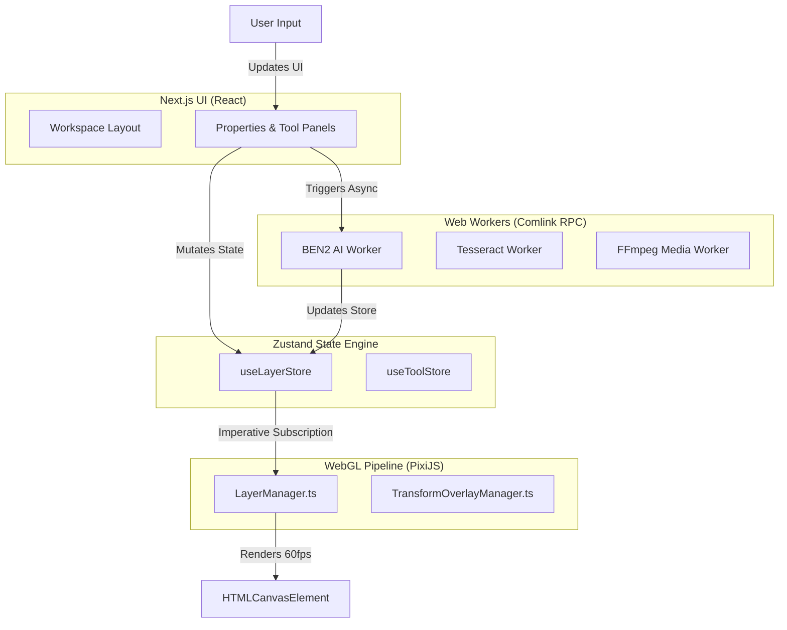

# File Forge Architecture Guide

File Forge is a next-generation, local-first media editor built entirely for the browser. It combines Next.js, PixiJS, and Web Workers to process intense media transformations (Background Removal, OCR, Audio/Video manipulation, PDF editing) directly on the client.

This document provides a deep, comprehensive overview of the system's architecture, data flows, and design patterns.

---

## 1. High-Level System Topology

File Forge uses a strict **decoupled architecture**. The UI layer (React) and the rendering/processing layers (PixiJS, Web Workers) operate on separate lifecycles, bridged entirely by a centralized, event-driven Zustand store.



---

## 2. The WebGL Rendering Pipeline (PixiJS)

The heart of File Forge's image editing experience is the PixiJS v8 engine. To guarantee 60 FPS across all devices, **React is completely removed from the rendering loop during interactions (dragging, scaling, rotating).**

### 2.1 The `LayerManager`
Instead of using declarative libraries like `@pixi/react`, File Forge uses an object-oriented `LayerManager.ts`.
- **Imperative Subscriptions**: The `LayerManager` subscribes directly to `useLayerStore.subscribe()`.
- **Reconciliation**: When the Zustand store updates, `LayerManager` diffs the new state against its internal Map of `PIXI.Container` objects.
- **Transform Syncing**: If a layer's `x`, `y`, `scaleX`, or `rotation` changes in the store, `LayerManager` instantly applies it to the corresponding PIXI Sprite.
- **GPU Masking**: To support AI-driven background removal, `LayerManager` utilizes `PIXI.AlphaMaskPipe`. It caches masks intelligently and ensures old textures are flushed from GPU VRAM (`texture.destroy(true)`) to prevent memory leaks.

### 2.2 The `TransformOverlayManager`
This class manages the UI overlays (bounding boxes, anchor handles, crop grids) that sit on top of the PixiJS stage.
- **Local-to-Global Projection**: It listens to the active layer's matrix and projects a responsive bounding box on the screen.
- **Rule of Thirds**: Dynamically draws high-fidelity grid lines when crop mode is active.

---

## 3. Web Worker Orchestration & AI

AI inference and Video/Audio processing are extraordinarily heavy. If run on the main thread, they would lock the browser UI. File Forge utilizes the **Web Worker Pattern** orchestrated via `Comlink` for seamless RPC (Remote Procedure Call).

### 3.1 Strict Worker Isolation
Previously, File Forge used a single monolithic worker for all AI operations. This caused catastrophic crashes when one library (e.g., ONNX) exhausted memory, taking down unrelated features (e.g., OCR). 
The architecture now guarantees **Fault Isolation**:
1. `ben2.worker.ts`: Exclusively runs `transformers.js` for background removal.
2. `ocr.worker.ts`: Exclusively runs `tesseract.js` for text extraction.
3. `audio.worker.ts` & `video.worker.ts`: Handle `ffmpeg.wasm`.

### 3.2 The AI Pipeline (`PipelinePlugin` Interface)
To future-proof the application against rapid advancements in AI models, models are implemented via the `PipelinePlugin` interface.
- **Hardware Probing**: Before instantiating a model, the orchestrator asynchronously probes `navigator.gpu`.
- **Graceful Fallbacks**: It attempts `WebGPU` (checking for `shader-f16` capabilities), falls back to `WebNN` (NPU), and finally defaults to multi-threaded `WASM` (`navigator.hardwareConcurrency`).

---

## 4. State Management (Zustand)

File Forge abandons monolithic global stores in favor of **Modular Slices**.

### 4.1 Store Modules
- `useLayerStore.ts`: The heaviest store. Maintains an array of `Layer` objects, managing Z-indexing, visiblity, and spatial transforms. Also manages the `past` and `future` stacks for Time Travel (Undo/Redo).
- `useToolStore.ts`: Extremely lightweight. Tracks the currently active tool route (e.g., `crop`, `magic-eraser`), brush size, and theme.
- `useAIStore.ts`: Manages AI lifecycle states (loading weights, processing masks, progress percentages).
- `useExportStore.ts`: Bridges the UI with the final canvas snapshot generation.

### 4.2 Zero-Lag React Bindings
Components like `PropertiesPanel` utilize `useShallow` to select *only* the specific properties they care about (e.g., `s.layers.find(l => l.id === s.activeLayerId)`). This prevents React from reconciling the vast sidebar tree every time the mouse moves 1 pixel.

---

## 5. The Dynamic Tool Registry

Writing redundant React components (sliders, toggles) for every new filter (Sepia, Vintage, Blur) is inefficient. File Forge utilizes a `toolRegistry.ts`.

- **JSON Definition**: You define a tool, its expected parameters (Min, Max, Default), and its target Web Worker logic in JSON.
- **Dynamic Mounting**: The `DynamicPropertiesPanel` iterates over the registry definition and automatically generates a premium, themed UI.
- **Automatic Routing**: `useDynamicTool` intercepts the slider values and passes them directly to the designated worker thread.

---

## 6. Persistence & Memory Safety

### 6.1 Dexie.js (IndexedDB)
Holding massive `File` objects or ArrayBuffers in Redux/Zustand RAM will quickly crash the browser (often hitting the 2GB/4GB V8 heap limit).
- **Blob Normalization**: `File` objects are instantly converted to generic `Blob`s and dumped into IndexedDB via `dexie`.
- **Reference Pointers**: The Zustand `useLayerStore` only keeps a lightweight UUID (`fileId`), never the actual Blob.

### 6.2 MongoDB & Supabase (Backend)
- **Identity Layer**: Powered entirely by `@supabase/auth-helpers-nextjs` for seamless Magic Links, OAuth, and JWT validation.
- **Database Layer**: MongoDB (Mongoose) is used for storing rich user profiles, active subscriptions, and user workspaces.
- **Hot-Reload Caching**: A global Mongoose connection cache (`src/lib/mongodb.ts`) ensures that Next.js Server Actions don't exhaust connection pools during local development.

---

## 7. Complete Project Directory Structure

```text
src/
├── app/                  # Next.js App Router (Pages, Layouts, API Routes)
│   ├── (tools)/          # Grouped routes for image/, video/, ai/, pdf/
│   ├── api/              # Serverless API handlers
│   ├── globals.css       # Semantic OKLCH CSS variables
│   └── layout.tsx        # Root layout, fonts, and theme providers
├── components/           # Reusable UI components
│   ├── ui/               # Radix/Tailwind generic components (buttons, dialogs)
│   └── workspace/        # Core workspace layouts (CanvasArea, ExportModal, PropertiesPanel)
├── config/               # Navigation menus, tool lists, and site metadata
├── db/                   # Dexie.js setup for IndexedDB Blob persistence
├── features/             # Feature-specific logic hooks & UI sub-components
│   ├── RemoveBackground/ # BEN2 background removal hooks
│   ├── OCR/              # Text extraction hooks
│   └── DynamicTools/     # Auto-generated UI for registry tools
├── hooks/                # Global React hooks (useBlobStorage, useCanvasExport, etc)
├── lib/                  # Framework-agnostic utilities
│   ├── pixi/             # WebGL LayerManager, TransformOverlayManager, MaskBrushController
│   ├── mongodb.ts        # Mongoose cached connection
│   └── toolRegistry.ts   # JSON definitions for dynamic tools
├── store/                # Zustand state slices
│   ├── index.ts          # Aggregated store actions (startOver)
│   ├── useLayerStore.ts  # Canvas layers and transforms
│   ├── useToolStore.ts   # Active tool and theme
│   ├── useAIStore.ts     # AI loading states
│   └── useExportStore.ts # Export triggering
└── workers/              # Isolated Web Workers (Comlink + WASM)
    ├── plugins/          # Interfaces for AI models (PipelinePlugin)
    ├── ben2.worker.ts    # Background removal worker
    ├── ocr.worker.ts     # Tesseract worker
    └── audio.worker.ts   # FFmpeg audio worker
```
