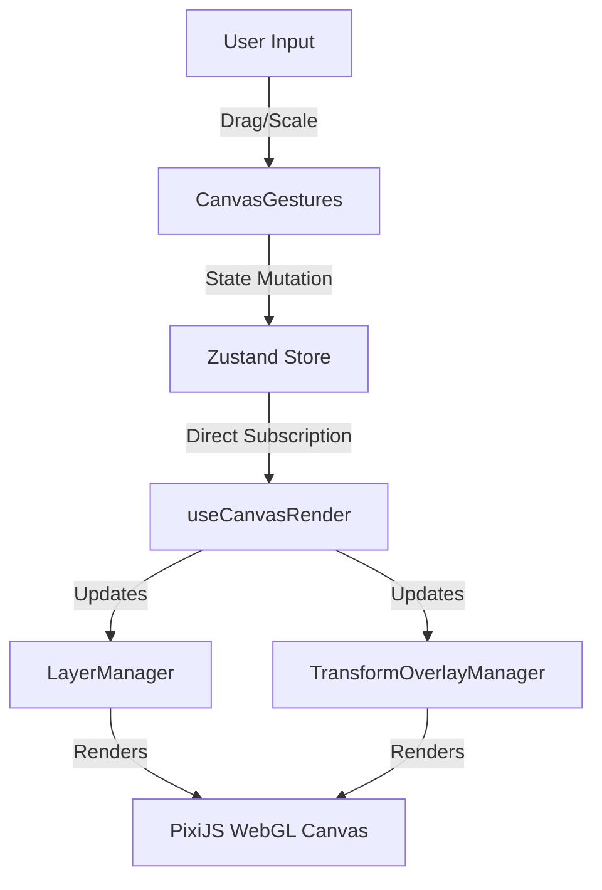
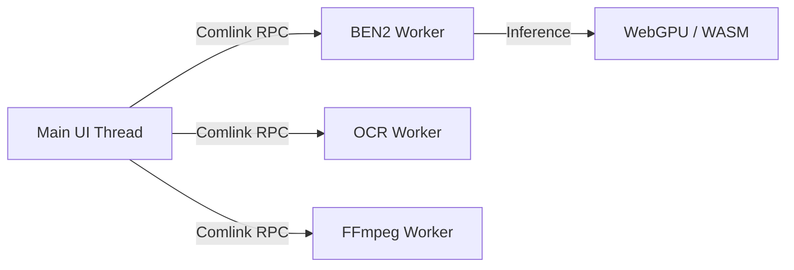

# File Forge Architecture

File Forge is a modern, modular, browser-based media editor built with Next.js, PixiJS, and Web Workers. It handles intense transformations (background removal, OCR, resizing, audio/video manipulation) entirely on the client side without servers.

This document serves as the canonical reference for the system design and architectural principles.

## Core Pillars

### 1. The PixiJS WebGL Pipeline (`LayerManager` & `TransformOverlayManager`)
The canvas renderer utilizes PixiJS v8. It strictly avoids React reconciliation for 60fps operations (like dragging/scaling) to ensure zero-lag performance on lower-end devices.

- **`LayerManager.ts`**: Encapsulates the entire lifecycle of PIXI Sprites, Textures, and Masks. It subscribes to Zustand store changes directly outside the React tree and orchestrates sprite transformations, z-indexing, and GPU mask swapping.
- **`TransformOverlayManager.ts`**: Handles drawing dynamic UI overlays on top of the active layer (e.g., crop grids, rotation handles, resize handles).

### 2. Isolated Web Worker Orchestration
Because AI models (ONNX) and FFmpeg WASM modules consume immense memory and can crash on older devices, each complex feature operates in a fault-isolated Web Worker.

- **`ben2.worker.ts`**: Dedicated to Background Removal via Transformers.js (`onnx-community/BEN2-ONNX`). Probes GPU for WebGPU + `shader-f16` support before loading, falling back to WebNN or WASM seamlessly.
- **`ocr.worker.ts`**: Dedicated to Tesseract.js Text Extraction. Kept completely separate from the ONNX runtime.
- **`audio.worker.ts` & `video.worker.ts`**: Handles heavy FFmpeg multiplexing.

### 3. Modular Zustand State (`src/store/`)
The application utilizes multiple independent Zustand store slices to prevent global re-renders and enforce a strict separation of concerns.

- **`useLayerStore`**: Manages the core tree of layers (IDs, Transforms, Filters).
- **`useToolStore`**: Tracks active tools (e.g. `crop`, `magic-eraser`, `text`) and environment theme.
- **`useExportStore`**: Tracks export events and triggers.
- **`useAIStore`**: Tracks AI progress and model loading states.

**Zero-Lag Render Bindings**: Components like `CanvasArea` and `PropertiesPanel` use optimized shallow subscriptions (`useShallow`) or direct imperative subscriptions (`useLayerStore.subscribe`) to stay completely detached from the 60fps drag-render cycle.

### 4. File Persistence (Dexie & IndexedDB)
Literal `File` objects are normalized to `Blob` objects and cached in IndexedDB via `dexie`. This ensures files survive page refreshes and prevents browser garbage collection from corrupting active memory pointers across Web Worker boundaries.

### 5. UI/UX Theming System (OKLCH)
A unified, semantic CSS-variable system (`globals.css`) using `oklch` ensures ultra-vibrant, Apple-tier light and dark modes. Tailwind gray classes are strictly forbidden in favor of semantic tokens like `bg-background`, `bg-panel`, and `border-panel-border`.

## Component Modularity
- **`WorkspaceLayout.tsx`**: Orchestrates global sidebars and top bars.
- **`CanvasArea.tsx`**: A pure DOM wrapper that initializes PixiJS via `usePixiApp`.
- **`PropertiesPanel.tsx`**: Dynamically displays tool-specific UI parameters based on `toolRegistry`.
- **`src/features/`**: Complex logic is extracted into standalone feature folders (e.g., `RemoveBackground`, `OCR`, `Crop`) to keep the main workspace clean.
