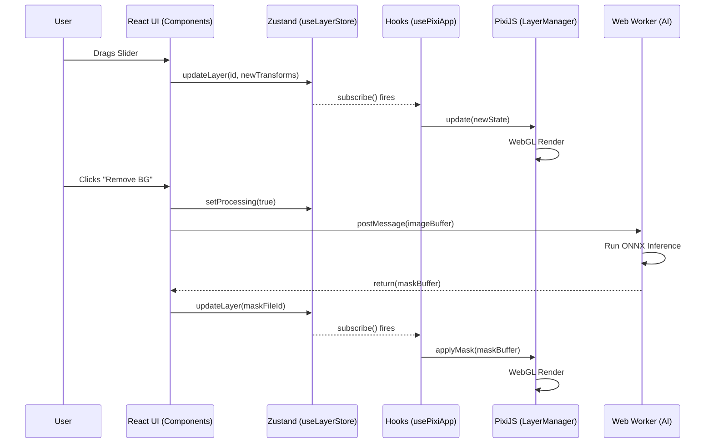

# File Forge Data Flow & Code Execution Path

This document explains the step-by-step execution path of data as it moves from the top-level user interface down to the bottom-level WebGL and Web Worker processing engines.

Use this guide to trace bugs, understand where state lives, and learn how to debug specific lifecycle phases.

---

## 1. Top-Level: User Interaction (React & UI)

The flow begins when a user interacts with the application.

1. **User Action**: The user uploads a file, moves a slider in the properties panel, or drags an image on the canvas.
2. **Component Level (`src/components/`)**:
   - For UI interactions (sliders, buttons), components like `PropertiesPanel.tsx` or `DynamicPropertiesPanel` capture the DOM event.
   - For Canvas interactions (dragging, rotating), `CanvasArea.tsx` captures pointer events. However, to maintain 60 FPS, rapid events are often sent directly to `useCanvasGestures.ts`.

## 2. State Mutation: The Zustand Gateway (`src/store/`)

React components almost never pass props down deeply. Instead, they immediately dispatch actions to the Zustand store.

1. **Action Dispatch**: A component calls an action, e.g., `updateLayer(id, { scaleX: 1.5 })`.
2. **State Slices**:
   - `useLayerStore.ts`: Handles the spatial properties (x, y, scale, rotation) and visibility of layers.
   - `useToolStore.ts`: Handles the active tool state.
3. **Immutability & History**: When `updateLayer` is called, Zustand creates a new immutable state tree. If the action is significant (e.g., dropping a new image), the previous state is pushed to the `past` array in `useLayerStore` for Undo functionality.

**Debugging Tip**: If the UI doesn't update, check if the Zustand state mutated correctly. You can log `useLayerStore.getState().layers` in the console.

## 3. The Synchronization Layer (Hooks)

Once Zustand state is updated, the app must synchronize this state to the non-React engines (PixiJS canvas or Web Workers).

### 3A. Visual Updates (`src/components/workspace/canvas/hooks/`)

- `useCanvasRender.ts` and `usePixiApp.ts` do **not** use React's `useEffect` to listen to fast-changing layer properties like `x` and `y`.
- Instead, they use `useLayerStore.subscribe(...)`.
- When the state changes, the subscriber instantly forwards the new state to the `LayerManager`.

### 3B. Heavy Processing (`src/features/`)

- If the user clicked "Remove Background", a hook like `useBackgroundRemoval.ts` detects the state change.
- It prepares the image data, converts it to an `ArrayBuffer`, and prepares to send it to the Web Worker.

## 4. Extreme Bottom: Execution Engines

This is where the actual pixel manipulation and AI inference occur.

### 4A. The Rendering Engine (`src/lib/pixi/LayerManager.ts`)

1. **State Ingestion**: `LayerManager` receives the updated state array.
2. **Reconciliation**: It diffs the new state against its internal Map of PIXI objects.
3. **WebGL Application**: It applies the raw transforms directly to the WebGL primitives (e.g., `sprite.x = layer.x`).
4. **Draw Call**: The PixiJS application automatically issues a new WebGL draw call on the next `requestAnimationFrame`.

**Debugging Tip**: If an image is in the Zustand store but not on the canvas, set a breakpoint in `LayerManager.syncLayer`. Ensure the texture loaded properly and wasn't destroyed.

### 4B. The AI/Media Web Workers (`src/workers/`)

1. **Comlink RPC**: The feature hook sends the data buffer to a Web Worker via Comlink (e.g., `await ben2Worker.processImage(buffer)`).
2. **Off-Main-Thread Execution**: The worker (`ben2.worker.ts`) receives the buffer. It loads the ONNX model (using WebGPU or WASM) and performs tensor math.
3. **Result Dispatch**: The worker returns a new `ArrayBuffer` (the generated mask).
4. **State Re-entry**: The hook receives the mask, converts it to a `Blob`, stores it in IndexedDB (Dexie), and calls `updateLayer(id, { maskFileId: newId })`.
5. **Final Render**: The cycle restarts at Step 2 (State Mutation), causing the `LayerManager` to apply the new mask to the WebGL sprite.

---

## 5. Summary Flowchart

